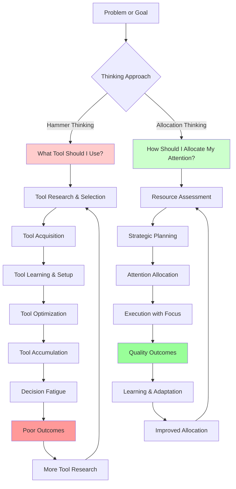
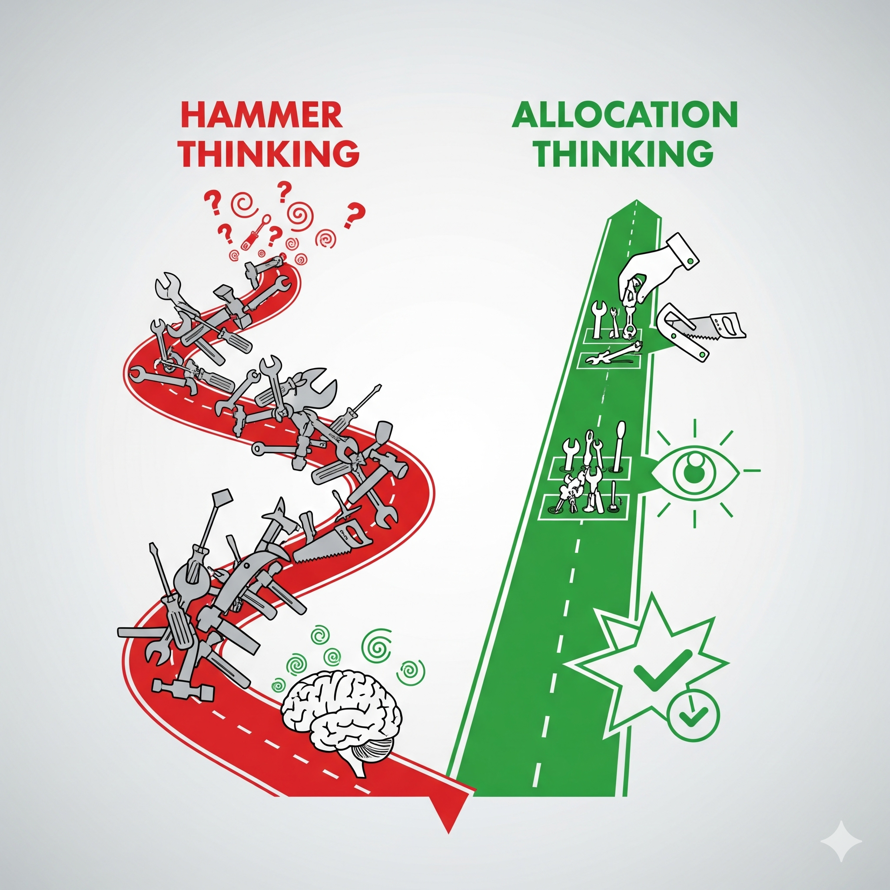

# Hammer vs. Allocation – *The Visual Framework*

> *A picture is worth a thousand words, but a good diagram is worth a thousand hours of trial and error. This visual framework will help you see the difference between tool-focused thinking and resource-focused thinking.*

---

## 1. The Core Concept

The fundamental difference between traditional productivity thinking and cognitive allocation thinking:

- **Hammer Thinking:** "What tool should I use?"
- **Allocation Thinking:** "How should I allocate my attention?"

---

## 2. The Mermaid Diagram

---

## 3. Detailed Breakdown

### Hammer Thinking Path (Red - Problematic)

#### Step 1: Tool Research & Selection

- **Focus:** Finding the "perfect" tool
- **Time Investment:** Hours researching options
- **Cognitive Load:** High (comparing features, reading reviews)
- **Outcome:** Analysis paralysis

#### Step 2: Tool Acquisition

- **Focus:** Getting the tool
- **Time Investment:** Download, install, setup
- **Cognitive Load:** Medium (technical setup)
- **Outcome:** Tool ownership

#### Step 3: Tool Learning & Setup

- **Focus:** Mastering the tool
- **Time Investment:** Days to weeks learning features
- **Cognitive Load:** High (learning new interface, workflows)
- **Outcome:** Tool proficiency

#### Step 4: Tool Optimization

- **Focus:** Making the tool work perfectly
- **Time Investment:** Ongoing tweaking and configuration
- **Cognitive Load:** Medium (constant optimization)
- **Outcome:** Tool mastery

#### Step 5: Tool Accumulation

- **Focus:** Adding more tools
- **Time Investment:** Repeating steps 1-4 for each new tool
- **Cognitive Load:** High (managing multiple systems)
- **Outcome:** Tool collection

#### Step 6: Decision Fatigue

- **Focus:** Choosing between tools
- **Time Investment:** Mental energy on tool selection
- **Cognitive Load:** High (constant decision-making)
- **Outcome:** Mental exhaustion

#### Step 7: Poor Outcomes

- **Focus:** Blaming tools for poor results
- **Time Investment:** More tool research
- **Cognitive Load:** High (frustration and confusion)
- **Outcome:** Vicious cycle

### Allocation Thinking Path (Green - Effective)

#### Step 1: Resource Assessment

- **Focus:** Understanding your cognitive capacity
- **Time Investment:** Minutes of self-reflection
- **Cognitive Load:** Low (simple awareness)
- **Outcome:** Self-knowledge

#### Step 2: Strategic Planning

- **Focus:** Planning how to use your resources
- **Time Investment:** Short planning sessions
- **Cognitive Load:** Medium (strategic thinking)
- **Outcome:** Clear direction

#### Step 3: Attention Allocation

- **Focus:** Deliberately directing your attention
- **Time Investment:** Moment-to-moment decisions
- **Cognitive Load:** Low (simple choices)
- **Outcome:** Focused effort

#### Step 4: Execution with Focus

- **Focus:** Doing the work with full attention
- **Time Investment:** Productive work time
- **Cognitive Load:** Optimal (challenging but manageable)
- **Outcome:** Quality work

#### Step 5: Quality Outcomes

- **Focus:** Achieving your goals
- **Time Investment:** Results that matter
- **Cognitive Load:** Low (satisfaction and clarity)
- **Outcome:** Success

#### Step 6: Learning & Adaptation

- **Focus:** Improving your approach
- **Time Investment:** Reflection and adjustment
- **Cognitive Load:** Medium (learning and growth)
- **Outcome:** Continuous improvement

#### Step 7: Improved Allocation

- **Focus:** Better resource management
- **Time Investment:** Refined strategies
- **Cognitive Load:** Low (established patterns)
- **Outcome:** Sustainable success

---

## 4. The Key Differences

### Time Investment

- **Hammer Thinking:** Hours on tool research, days on setup, weeks on optimization
- **Allocation Thinking:** Minutes on planning, focus on execution

### Cognitive Load

- **Hammer Thinking:** High load on tool management, low load on actual work
- **Allocation Thinking:** Low load on process, high load on meaningful work

### Outcomes

- **Hammer Thinking:** Tool mastery, decision fatigue, poor results
- **Allocation Thinking:** Goal achievement, sustainable performance, continuous growth

### Sustainability

- **Hammer Thinking:** Unsustainable (constant tool churn)
- **Allocation Thinking:** Sustainable (established patterns)

---

## 5. Real-World Examples

### Example 1: Writing a Report

#### Hammer Thinking Approach

1. Research the best writing software
2. Download and learn Scrivener
3. Set up templates and workflows
4. Optimize the writing environment
5. Finally start writing (exhausted from setup)
6. Get poor results due to fatigue
7. Blame the tool and try a different one

#### Allocation Thinking Approach

1. Assess your writing energy and time
2. Plan the report structure and key points
3. Allocate focused time for writing
4. Write with full attention
5. Get quality results
6. Learn from the experience
7. Improve your allocation strategy

### Example 2: AI Collaboration

#### Hammer Thinking Approach

1. Research the best AI tools and prompts
2. Try multiple AI platforms
3. Collect hundreds of prompt templates
4. Optimize your AI workflow
5. Get overwhelmed by options
6. Produce mediocre results
7. Blame the AI for poor outputs

#### Allocation Thinking Approach

1. Assess your cognitive capacity for AI collaboration
2. Plan your context-building strategy
3. Allocate attention to quality input
4. Focus on strategic direction and quality control
5. Get excellent results
6. Learn from the collaboration
7. Refine your allocation approach

---

## 6. The Claraforge Connection

### How Claraforge Embodies Allocation Thinking

- **Simple, focused tools** (markdown files, basic structure)
- **Rich, strategic content** (philosophy, context, principles)
- **Attention on outcomes** (better AI collaboration, not tool mastery)
- **Sustainable patterns** (forkable, adaptable, maintainable)

### The Anti-Pattern Claraforge Avoids

- **Tool proliferation** (one simple system that works)
- **Constant optimization** (stable patterns that can be maintained)
- **Feature accumulation** (focus on core principles)
- **Decision fatigue** (clear, consistent approach)

---

## 7. Practical Application

### How to Use This Diagram

1. **Identify your current approach:** Are you in hammer thinking or allocation thinking mode?
2. **Recognize the cycle:** Which step in the cycle are you currently at?
3. **Choose your path:** Decide whether to continue with your current approach or switch
4. **Take action:** Make one small change to move toward allocation thinking
5. **Track results:** Notice the difference in outcomes and cognitive load

### Warning Signs of Hammer Thinking

- **Spending more time on tool research than actual work**
- **Constantly switching between different tools and systems**
- **Feeling overwhelmed by options and decisions**
- **Getting poor results despite having "the best" tools**
- **Blaming tools for poor outcomes**

### Signs of Effective Allocation Thinking

- **Spending most time on actual work, not tool management**
- **Using simple, consistent tools and processes**
- **Feeling focused and energized during work**
- **Getting quality results with less effort**
- **Taking responsibility for outcomes and learning from experience**

---

## 8. Integration with Other Module Components

### Connection to Hook Examples

- **Calculator Metaphor:** Allocation thinking is like using the calculator's memory slots strategically
- **GPS Metaphor:** Allocation thinking is like trusting the GPS for route planning while focusing on driving
- **Fridge Metaphor:** Allocation thinking is like meal planning to match decision complexity to energy level

### Connection to Three Myths

- **Myth 1 (More Tools = Better):** Hammer thinking is the embodiment of this myth
- **Myth 2 (Complexity Is Bad):** Allocation thinking embraces intentional complexity
- **Myth 3 (Minimize All Load):** Allocation thinking optimizes load strategically

### Connection to the Exercise

- The exercise will help you identify which thinking mode you're currently in
- You'll practice switching from hammer thinking to allocation thinking
- You'll experience the difference in outcomes and cognitive load

---

>*Remember: The goal isn't to never use tools—it's to use tools strategically as part of a larger allocation strategy, not as the primary focus of your productivity efforts.*

---

**🎯 Ready to see this in action?**  
*Move on to the [15-minute exercise](./exercise.md) to practice switching from hammer thinking to allocation thinking in real scenarios.*
